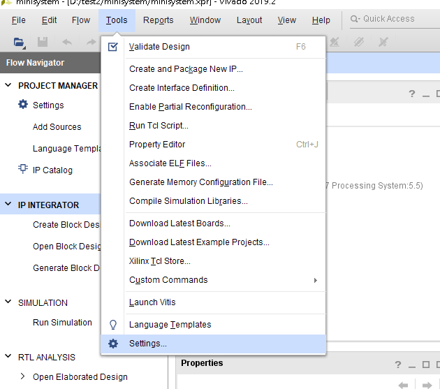

- [vivado 匯入自訂IP](#vivado-匯入自訂ip)
- [EMMC使用](#emmc使用)

# vivado 匯入自訂IP

- 方法




設定放IP的目錄，vivado會自動往目錄下找所有的IP


___

# EMMC使用

- 在vivado中設定使用EMMC（在picozed裡EMMC是SD1)
  

- (**`vivado 2019.2版無此問題`**)在設置petalinux-config 主SD為1(SD1)後，uboot啓動指令沒有做出相對應的修改，這算是官方軟體的bug，所以要手動修`<plnx-proj-root>/project-spec/meta-plnx-generated/recipes-bsp/u-boot/configs/platform-auto.h` ，將sdbootdev修改等於1，如下圖．[詳細參考][6]
  
  

- 利用fdisk將mmcblk0做磁區分割，再利用mkfs.ext4 指令做格式化，若沒有此指令，則需
  
  
  
  ```
  petalinux-config -c rootfs
  ```

- 詳細流程
  
  ```
       petalinux-config
  ```
  
  > Filesystem Packages --->
  > 
  > > base --->
  > > 
  > > > e2fsprogs --->
  > > > 
  > > > > [*] e2fsprogs  
  
   若沒有mkfs指令
  
  > > > util-linux --->
  > > > 
  > > > > [*] util-linux
  
   重新build即可使用   
  
   準備燒錄檔  
   Step 1.
  
  > Image Packaging Configuration --->
  > 
  > > Root filesystem type (EXT (SD/eMMC/QSPI/SATA/USB)) --->
  
  > > (/dev/mmcblk0p2) Device node od SD device [註解1]
  
  > Subsystem AUTO Hardware Settings --->
  > 
  > > SD/SDIO Settings --->
  > > 
  > > > Primary SD/SDIO (ps7_sd_1) --->
  > > > 
  > > > > (X) ps7_sd_1   
  > > > > ( ) manual  
  
  > Advanced bootable images storage Settings --->
  > 
  > > boot image settings --->
  > > 
  > > > image storage media (primary flash) --->
  > > > 
  > > > > (X) primary flash  
  > > > > ( ) primary sd  
  > > > > ( ) manual
  
  > kernel image settings --->
  > 
  > > image storage media (primary sd) --->
  > > 
  > > > ( ) primary flash  
  > > > (X) primary sd  
  > > > ( ) ethernet  
  > > > 
  > > > > ( ) manual  
  
   build 專案
  
  ```
   petalinux-build
  ```
  
   Step 2.  
   &emsp;&emsp;&emsp;將zynq_fsbl.elf system.bit uboot.elf 包成BOOT.bin之後燒錄在QSPI flash  
   Step 3.  
   &emsp;&emsp;&emsp;開發板利用tftp的方式進入命令列  
   Step 4.  
   &emsp;&emsp;&emsp;將build好的rootfs.tar.gz 透過scp的方式放到開發板裡  
  
  ```
  scp -v rootfs.tar.gz root@10.0.1.110:/home/root
  ```
  
  Step 5.  
  &emsp;&emsp;&emsp;在開發板裡先確定mmcblk0p2是否存在 /run/media/裡，若不存在則表示eMMC驅動未完成．若存在請執行下面命令 [註解2]
  
  ```
  tar xvf rootfs.tar.gz -C /run/media/mmcblk0p2 & sync
  ```

___

[1]: ./png/vivado_IP_import1.png
[2]: ./png/vivado_IP_import2.png
[3]: ./png/vivado_IP_import3.png
[4]: ./png/vivado_EMMC1.png
[5]: ./png/vivado_EMMC2.png
[6]: http://news.migage.com/articles/ZYNQ7000+%235++%E4%BB%8Evivado%E5%B7%A5%E7%A8%8B%E5%BC%80%E5%A7%8B%EF%BC%8C%E4%BB%8Eemmc%E5%90%AF%E5%8A%A8Linux_2425673_csdn.html
[註解1]: 1 "在2019.2版裡，vivado裡開啓一個SD 不管是SD0或SD1，會指定到 **mmcblk0** 至於是使用mmcblk0p1或mmcblk0p2則由自己分割磁區時決定，但一定要EXT4格式"
 [註解2]: 2 "指令可分開下，但解壓完成後一定要再下sync指令，不然重開機後會遇到 Starting init: /sbin/init exists but couldn't execute it (error -8)"